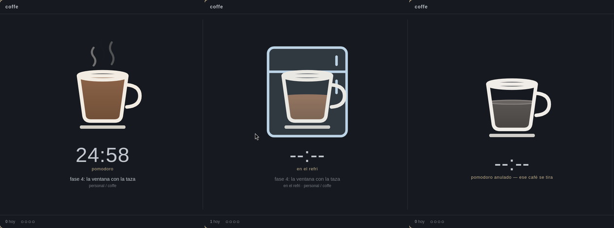
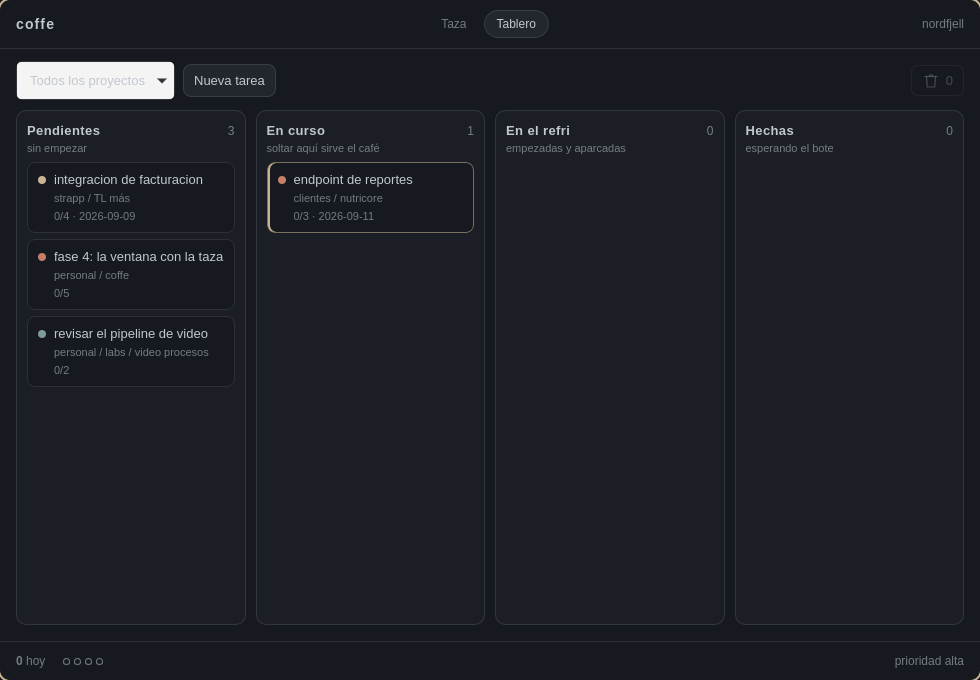
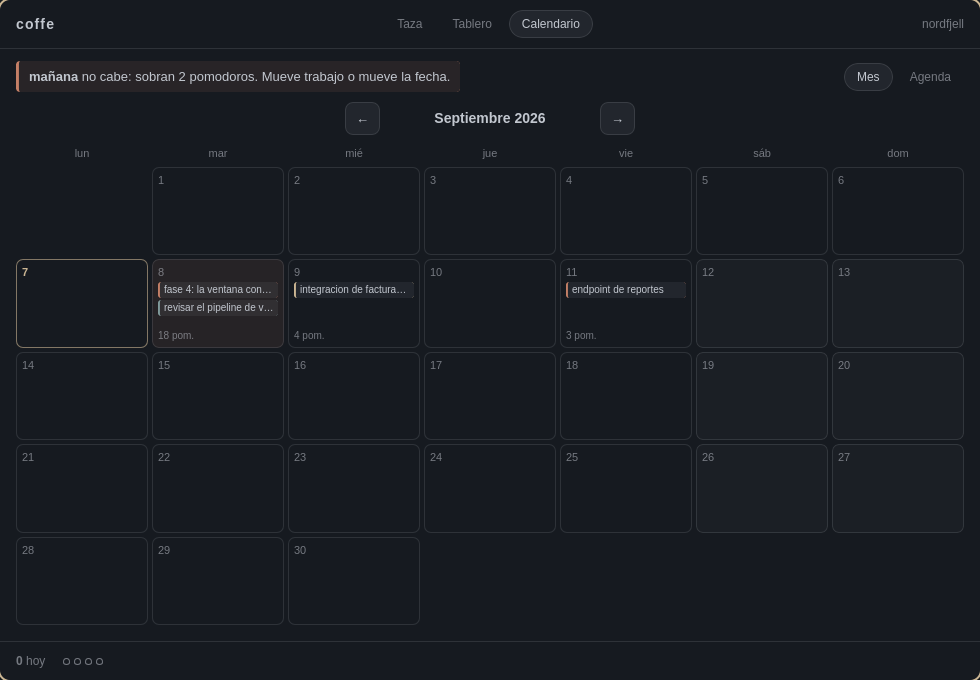

# coffe

Un pomodoro para [Omarchy](https://omarchy.org/): vive en waybar y abre una
ventana donde el temporizador es una taza de café.

Sigue el método de Cirillo de verdad, no de adorno: el pomodoro es indivisible,
el descanso es obligatorio, y lo que se interrumpe se anula y queda registrado
como tal. Las estadísticas no sirven de nada si mienten.



Se vacía mientras trabajas, se recarga en el descanso, entra al refri cuando
aparcas una tarea, y se queda gris cuando un pomodoro se anula. La taza es lo
único que no sigue al tema de Omarchy: su borde es hueso y su café es café.

## En la barra


No lleva `interval`: el módulo se queda suscrito al daemon y recibe una línea
por segundo mientras el reloj corre, así que la cuenta atrás se mueve sin que
waybar arranque 86.400 procesos al día. Clic izquierdo abre la ventana, el
derecho manda la tarea al refri, el central tira el pomodoro. `SUPER ALT+P`
alterna arrancar y aparcar sin soltar el teclado.

## El tablero



Arrastrar una tarjeta a «En curso» **le pide un pomodoro al daemon**, no escribe
el estado: el estado de una tarea lo manda el reloj, no la interfaz. Si lo
escribiera, quedaría una tarea marcada como trabajándose sin nada detrás.

Las prioridades se congelan con el primer pomodoro, y no se descongelan
devolviendo la tarjeta a pendiente.

## El calendario



No está para enseñar en qué casilla cae cada entrega, sino para responder si
**cabe**: compara lo que se debe acumulado contra lo que cabe acumulado y dice
*«mañana no cabe: sobran 5 pomodoros»*. Lo vencido no se reparte hacia atrás,
cae entero sobre hoy — en los días que ya pasaron no queda capacidad que gastar.

Y cuando la cuenta ignora algo, lo dice: *«3 con entrega y sin estimar no entran
en la cuenta»*. Un total que se calla lo que ignora es peor que no tener total.

## Qué mide

Tres medidas del tiempo, que no son la misma:

| | |
|---|---|
| **efectivo** | los pomodoros que sonaron |
| **dedicación** | el rato en que de verdad estuviste en la tarea |
| **calendario** | desde que empezaste hasta que acabaste |

Cincuenta minutos de trabajo repartidos en dos días y medio no son cincuenta
minutos. Además: pomodoros anulados y por qué, interrupciones internas (`'`) y
externas (`"`), cuántas veces la aparcaste, y —medido por los hooks de Claude
Code, no estimado— cuánto del trabajo se hizo con Claude.

## Instalación

```bash
git clone git@github.com:ElYares/omarchy-coffe-pomo.git
cd omarchy-coffe-pomo && ./install.sh
```

Compila, instala los binarios y deja el daemon corriendo. **No toca tu waybar,
tu hyprland ni tu configuración de Claude**: son archivos tuyos con historia
dentro, así que te dice qué pegar y dónde. Los bloques están en
[`packaging/`](packaging/README.md).

## Uso

```bash
coffe project add strapp
coffe project add tl-mas --parent strapp
coffe project repo tl-mas ~/develop/work/tl-mas

coffe task add "integración de facturación" -P alta -d 2026-09-11 -e 4
coffe start 1        # arranca el pomodoro
coffe interrupt -e   # apunta que te interrumpieron, sin cortar nada
coffe pause          # al refri: anula el pomodoro, guarda la tarea
coffe resume         # saca del refri lo último que guardaste

coffe status
coffe task show 1    # las tres medidas, una debajo de otra
coffe report         # en qué se te fue la semana
coffe export tareas > tareas.csv
```

### Desde el vault de Obsidian

Si escribes tus historias de usuario en un vault, se traen al tablero:

```bash
coffe vault scan                                  # qué hay y a qué apunta
coffe project vault strapp/tl-mas tl-mas-server   # ligar, uno a uno
coffe vault import --dry-run
coffe vault import
```

Es idempotente, así que se puede correr cuando apetezca. **Solo lee**: no
escribe una línea en el vault. Y lo que el vault nunca toca es el estado de una
tarea ni la prioridad de algo que ya se trabajó.

## Cómo está hecho

```
crates/coffe-core/   dominio, persistencia y los cálculos que se prueban
crates/coffe-ipc/    protocolo del socket + cliente síncrono
crates/coffe-cli/    binario `coffe`: CLI, daemon y módulo de la barra
app/                 la ventana: React + TypeScript sobre Tauri v2
```

El reloj vive en un daemon, no en la ventana: cerrarla no para un pomodoro y
abrir dos no crea dos relojes. La máquina de estados es una función pura que
recibe el instante como argumento, así que se puede comprobar un descanso largo
sin esperar dos horas.

Decisiones y porqués en [`docs/ARQUITECTURA.md`](docs/ARQUITECTURA.md);
el plan por fases, en [`docs/FASES.md`](docs/FASES.md).

## Desarrollo

```bash
cargo test                   # 124 pruebas
cargo clippy --all-targets
cd app && pnpm dev           # y en otra terminal: cargo run -p coffe-app
```

## Licencia

MIT.
